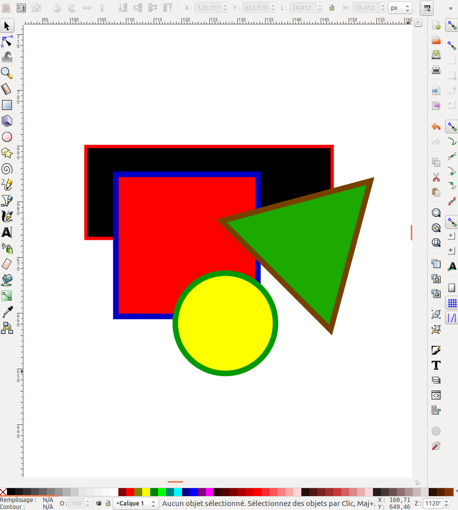
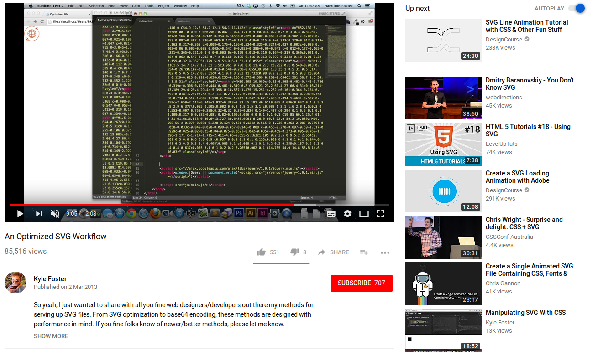
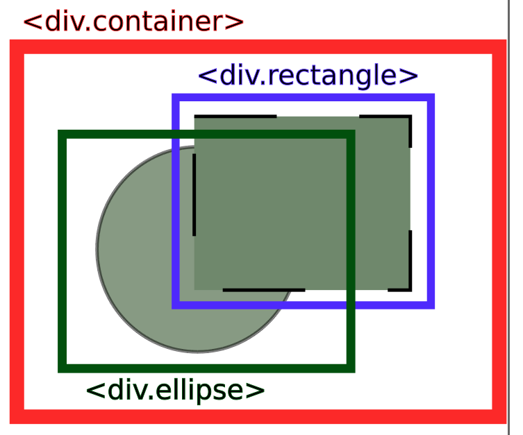
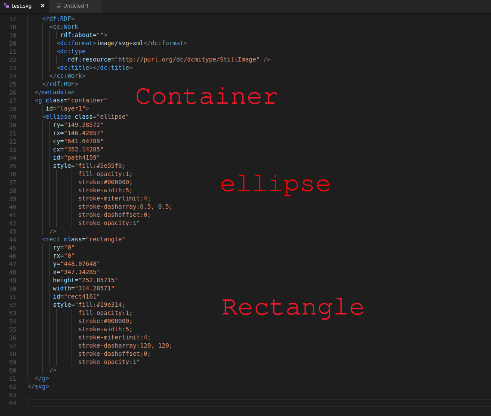

# Le format SVG


## Le format SGV, c'est quoi?

Le **S**calable  **V**ector  **G**raphics « graphique vectoriel adaptable », est un format de **dessin vectoriel** capable d’être traduit en **XML** (langage balisé). Il est approuvé par le World Wide Web Consortium.


## Pourquoi utiliser SVG? ##

* La **taille** du fichier est considérablement **réduite**. (bonne compression) (PNG = 35,5 ko (35.499 octets) -- SVG = 576 octets)
* Infiniment grand et infiniment petit. (**dessin vectoriel**)
* Le format est directement reconnu en langage balisé via n'importe quel traitement de texte.
* Compatible avec tous les navigateurs. (sauf avec IE 8 et antérieurs, et Android 2.3 et antérieurs)

## Prérequis: ##

### Installer Inskape:

* via **linux** il suffit de cliquer <a href="apt://inkscape"> ici</a> et de suivre les instructions.
* Pour **Windows** cliquez<a href="https://inkscape.org/fr/release/0.92.3/windows/64-bit/exe/dl/" target="_blank"> ici</a> pour télécharger l'executable.
* Pour Ludo (pour ceux qui ne connaitraient pas Ludo, je parle des utilisateurs d'**Apple**) c'est <a href="" target="_blank">ici</a> que ça se passe ;-)

<br>

# Chapitres:

<details> 
  <summary>Chapitre 1 : Création d'une image SVG </summary>

## Comment ca marche?

Télécharger un fichier SVG sur le net, [vive google](www.google.fr), ou encore mieux en créer un avec un logociel de dessin vectoriel comme [Illustrator](www.adobe.com) (coûte une fortune) ou [Inskape](www.inskape.com) qui est plutôt sympa et surtout open source.

[](p1.png)

## L'interface Inskape:

Voici les outils dont vous aurez besoin pour effectuer ce tuto:

[](interface-inkscape.png)

1. Selectionner et transformer des objets.
2. Créer des rectangles et des carrés.
3. Créer des cercles.
4. Créer des polygones.
5. Editer les couleurs et les contours des objets.

## Amusez-vous:

* Dessine un cercle, ajoute lui une couleur de fonds et une bordure.
* Dessine un carré.
* Un rectangle.
* Et un triangle.


[](inkscape-formes.png)

## Optimiser le code:

Même si le code SVG est déjà tres bien optimisé à la base, il est possible de l'optimiser encore plus.
En fonction du logiciel utilisé pour générer le fichier, il y a généralement un **DOCTYPE** , des **annotations** et d'autres choses qui sont inutiles. Il existe des outils comme [SVGO](#) de Node JS. 

[](https://www.youtube.com/watch?v=iVzW3XuOm7E&feature=youtu.be)

## Prendre le controle avec CSS:

Pour l'exemple, j'ai créé un fichier SVG très simple, deux éléments: une ellipse bleue sous un rectangle vert, les deux ont un contours de 5 pixels noir.


Si on devait refaire plus ou moins la même chose avec du html et du css, voilà comment on s'y prendrait:



C'est maintenant qu'on va parler du code SVG et de ses balises natives.
Dans mon exemple, on retrouve ces balises: 

* **< xml >** : parametre xml (version, UTF-8, etc..)
* **< svg >** : parametre svg ( une sorte de HTML)
* **< g >** : représente la div qui contient tous les èlèments.
* **< ellipse >** : contient les formes de type ellipse.
* **< rect >** : contient les rectangles carrés etc. *logique* :-)
* **< path >** : Pour les formes complexes, la div s'appelle path.



 *On reviendra sur les propriétés dans un instant.* 

Pour pouvoir modifier le css de chaque élément, il suffit de lui attribuer une class comme pour n'importe quelle balise HTML traditionnelle.

Comme ca, il ne reste plus qu'à ajouter ces class dans le css et s'amuser à modifier le style de chaque èlèment du dessin. 

Bien sûr, ca marche aussi avec du JS, c'est ce qu'on va voir maintenant.
</details>

<details> 
  <summary>Chapitre 2 : Interation avec JS </summary>

# Création d'une carte interactive.

[Voila le résultat](http://workshop.surikate.be/) et  [ici](https://github.com/geocani/SVG/tree/master/map) les fichier sources.

## Création de la carte:

* j'ai dessiné une carte de la Belgique, chaque forme (province) est dans un calque différent ( *Travailler avec les calques [calques](https://fr.flossmanuals.net/inkscape/layers/) et les nommer permet de créer une sorte de ```<div>``` pour chaque dessin, une chose de moins à faire lors de l'optimisation du code.* )

* Ensuite, j'ai commenté et optimisé le code en suppriment les meta inutile et en ajoutant des ID pour les sélectionner plus facilement:

[](svg-opti.png)

## Intégration de l'image:

* Créer un document html
* Pour que ça soit plus propre, y ajouter des balises ```<html>```, ```<meta>``` et ```<body>``` ;-)
* Ajouter une ```<div class="map">``` qui contiendra la carte et la liste des provinces. Dedans, y ajouter deux div l'une en dessous de l'autre. ```<div class=".map__carte">``` et ```<div class="map__provinces">```. ( *[Pourquoi "__"? La methodologie BEM](https://blog.webnet.fr/methodologie-bem-bloc-element-modificateur/)* )


* Coller le code SVG de la carte entre les balises ```<div class=".map__carte">```
* Et dans ```<div class="map__provinces">``` créer une liste avec le nom de chaque province.
* Ajouter un identifiant à chaque province :

[](liste-code.png)

* Et peu de CSS:

[](css-svg.png)


## C'est la qu'on code vraiment.

### Ajout du JavaScript:

* Entre deux balises ```<script>``` :

```
let map = document.querySelector('#map');// SELECTION DE LA DIV "MAP"
let provincesImg = document.querySelectorAll('.map__carte g'); // SELECTION DE TOUT LES "G"
let provincesList = document.querySelectorAll('.map__provinces li'); // SELECTION DE TOUT LES "UL"

provincesImg.forEach(function(path){ // POUR CHAQUE "g" 
    path.addEventListener('mouseenter', function(e) { // AU MOMENT Où LE CURSEUR ENTRE DANS LA ZONE
        let id = this.id.replace('province-','')
        map.querySelectorAll('.is-active').forEach(function (item){
            item.classList.remove('is-active')
        })
        document.querySelector('#list-' + id).classList.add('is-active'); // RAJOUTE LA CLASS "is-active" 
        document.querySelector('#province-' + id).classList.add('is-active'); // RAJOUTE LA CLASS "is-active"
    })
})
```

</details>


# SOURCES:

* https://www.grafikart.fr/
* https://www.w3schools.com/graphics/svg_intro.asp
* https://fr.wikipedia.org/wiki/Scalable_Vector_Graphics
* https://www.amcharts.com/
* https://www.creativebloq.com/how-to/animate-svg-with-javascript


