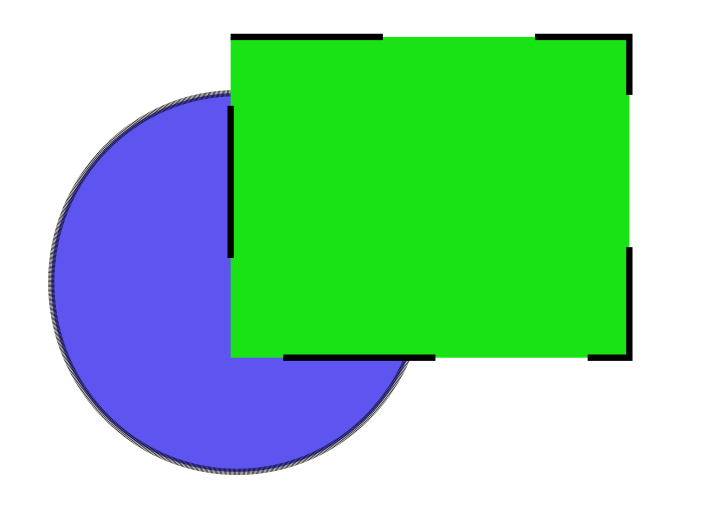

# Animer un SVG avec CSS


## Le format SGV c'est quoi?

Le **S**calable  **V**ector  **G**raphics « graphique vectoriel adaptable », est un format de **dessin vectoriel** capable d’etre traduit en **XML** (langage balisé). Il est approuvé par par le World Wide Web Consortium.

## Pourquoi utiliser SVG? ##

* La taille du fichier est considérablement réduite. (bonne compression)
* Infiniment grand et infiniment petite. (dessin vectoriel)
* Le format est directement reconu en langage balisé via n'importe quel traitement de texte.
* Compatible avec tout les navigateurs. (sauf avec IE 8 et antérieurs, et Android 2.3 et antérieurs)

## Comment ca marche?

#### UN : Trouver une image SVC:

Télécharger un fichier SVG sur le net, [vive google](www.google.fr), ou encore mieux en créer une avec un logociel de dessin vectoriel comme [Illustrator](www.adobe.com) (coute une fortune) ou [Inskape](www.inskape.com) qui est plutot sympa et surtout open source.

[](p1.png)

#### DEUX : Récupérer le code:

Pour récuperer le code d'une image SVG rien de plus simple, il suffit d'ouvrir l'image dans son éditeur de txt préféré puis de coller le code a l'endoit ou l'on voudrais qu'elle se place sur la page HTML.

Paratique, car cela ne demande aucune requete HTTP. 


[](p2.png)

(Il est aussi possible aussi d'inclure le fichier avec PHP):

```<?php echo include("kiwi.svg"); ?>``` 

**Si on regarde le code de plus pret on remarque qu'il est composée d'une grande partie de métadonnée et quelque balise qui n'existe pas en HTML mais j'y reviendrais plus tard.*

#### TROIS : Optimiser le code:

Meme si le code SVG est deja tres bien optimisé à la base, il est possible de l'optimiser encore plus.
En fonction du logiciel utilisé pour generer le fichier il y a généralement un DOCTYPE , des annotations et d'autre chose qui sont inutile. Il existe des outils comme [SVGO](https://github.com/svg/svgo) de Node JS. 

[](https://www.youtube.com/watch?v=iVzW3XuOm7E&feature=youtu.be)

#### QUATRE : Prendre le controle avec CSS:

Pour l'exemple j'ai créé un fichier SVG tres simple, deux élément: une ellipse bleu sous un rectangle vert, les deux ont un contoure de 5 pixel noir.



Si on devait refaire plus ou moins la meme chose avec du html et du css voila comment on s y prendrait:


C est maintenant qu'on va parler du code SVG et de ses balise native.
dans mon exemple on retrouve ces balise: 

* **< xml >** : parametre xml (version, UTF-8, etc..)
* **< svg >** : parametre svg (sorte de HTML)
* **< g >** : représente la div qui contiens tout les elements.
* **< ellipse >** : contient l'elipse.
* **< rect >** : contient le rectangle. *logique* :-)
* **< path >** : Pour les formes complexe la div s'appel path.


 *On reviendra les propriétés dans un instant.* 

Pour pouvoir modifier le css de chaque éléments il suffit de lui attribuer une class comme pour n'importe quel balise HTML traditionnel.

Comme ca il ne reste plus qu'a ajouter ces class dans le css et s'amuser à modifier le style de chque element du dessin. (Biensur ca marche aussi avec du JS).

## (petite) complication:

Pour modifier un éléments il suffit d'ajouter des propriété css à sa class oui mais il faut tenire compte des propriété réservés à SVG.

Exemple: 

* *"**background-color**"* deviendra *"**fill**"*.
* *"**border**"* deviendra *"**stroke**"*.
* *"**border-radius**"* deviendra *"**rx, ry**"*.

```
.rectangle{
    fill:#5e55f0;
    fill-opacity:1;
    stroke:#000000;
    stroke-width:5;
    stroke-dasharray:0.5, 0.5;
    stroke-opacity:1" 
```

 

## l'animation SVG :

C est la que ca devient intérésent! 

comme il est tres simple d'inclure un fichier SVG et d acceder aux porpriété de chaque éléments du dessin, il est possible de coder des animations assez complexe.


l existe plusieur facons pour animer une image **SVG**, Pour des animations sofistiqué il sera preferable de passer par JavaScript ou l'une de ses bibliothèques comme [Sanp.svg](https://http://snapsvg.io/) ou [SVG.js](https://http://svgjs.com/).
La méthode la moins lourde est appelé SVG inline , elle consiste à animer l'image directement avec du css. 


### Features

- Support Standard Markdown / CommonMark and GFM(GitHub Flavored Markdown);
- Full-featured: Real-time Preview, Image (cross-domain) upload, Preformatted text/Code blocks/Tables insert, Code fold, Search replace, Read only, Themes, Multi-languages, L18n, HTML entities, Code syntax highlighting...;
- Markdown Extras : Support ToC (Table of Contents), Emoji, Task lists, @Links...;
- Compatible with all major browsers (IE8+), compatible Zepto.js and iPad;
- Support identification, interpretation, fliter of the HTML tags;
- Support TeX (LaTeX expressions, Based on KaTeX), Flowchart and Sequence Diagram of Markdown extended syntax;
- Support AMD/CMD (Require.js & Sea.js) Module Loader, and Custom/define editor plugins;

# Editor.md


     


**Table of Contents**

[TOCM]

[TOC]

# H1 header
## H2 header
### H3 header
#### H4 header
##### H5 header
###### H6 header
# Heading 1 link [Heading link](https://github.com/pandao/editor.md "Heading link")
## Heading 2 link [Heading link](https://github.com/pandao/editor.md "Heading link")
### Heading 3 link [Heading link](https://github.com/pandao/editor.md "Heading link")
#### Heading 4 link [Heading link](https://github.com/pandao/editor.md "Heading link") Heading link [Heading link](https://github.com/pandao/editor.md "Heading link")
##### Heading 5 link [Heading link](https://github.com/pandao/editor.md "Heading link")
###### Heading 6 link [Heading link](https://github.com/pandao/editor.md "Heading link")

## Headers (Underline)

H1 Header (Underline)
=============

H2 Header (Underline)
-------------

###Characters
                
----

~~Strikethrough~~ <s>Strikethrough (when enable html tag decode.)</s>
*Italic*      _Italic_
**Emphasis**  __Emphasis__
***Emphasis Italic*** ___Emphasis Italic___

Superscript: X<sub>2</sub>，Subscript: O<sup>2</sup>

**Abbreviation(link HTML abbr tag)**

The <abbr title="Hyper Text Markup Language">HTML</abbr> specification is maintained by the <abbr title="World Wide Web Consortium">W3C</abbr>.

###Blockquotes

> Blockquotes

Paragraphs and Line Breaks
                    
> "Blockquotes Blockquotes", [Link](http://localhost/)。

###Links

[Links](http://localhost/)

[Links with title](http://localhost/ "link title")

`<link>` : <https://github.com>

[Reference link][id/name] 

[id/name]: http://link-url/

GFM a-tail link @pandao

###Code Blocks (multi-language) & highlighting

####Inline code

`$ npm install marked`

####Code Blocks (Indented style)

Indented 4 spaces, like `<pre>` (Preformatted Text).

    <?php
        echo "Hello world!";
    ?>
    
Code Blocks (Preformatted text):

    | First Header  | Second Header |
    | ------------- | ------------- |
    | Content Cell  | Content Cell  |
    | Content Cell  | Content Cell  |

####Javascript　

```javascript
function test(){
	console.log("Hello world!");
}
 
(function(){
    var box = function(){
        return box.fn.init();
    };

    box.prototype = box.fn = {
        init : function(){
            console.log('box.init()');

			return this;
        },

		add : function(str){
			alert("add", str);

			return this;
		},

		remove : function(str){
			alert("remove", str);

			return this;
		}
    };
    
    box.fn.init.prototype = box.fn;
    
    window.box =box;
})();

var testBox = box();
testBox.add("jQuery").remove("jQuery");
```

####HTML code

```html
<!DOCTYPE html>
<html>
    <head>
        <mate charest="utf-8" />
        <title>Hello world!</title>
    </head>
    <body>
        <h1>Hello world!</h1>
    </body>
</html>
```

###Images

Image:


> Follow your heart.


> 图为：厦门白城沙滩 Xiamen

图片加链接 (Image + Link)：

[](https://pandao.github.io/editor.md/examples/images/7.jpg "李健首张专辑《似水流年》封面")

> 图为：李健首张专辑《似水流年》封面
                
----

### Lists

#### Unordered list (-)

- Item A
- Item B
- Item C
     
#### Unordered list (*)

* Item A
* Item B
* Item C

#### Unordered list (plus sign and nested)
                
+ Item A
+ Item B
    + Item B 1
    + Item B 2
    + Item B 3
+ Item C
    * Item C 1
    * Item C 2
    * Item C 3

#### Ordered list
                
1. Item A
2. Item B
3. Item C
                
----
                    
###Tables
                    
First Header  | Second Header
------------- | -------------
Content Cell  | Content Cell
Content Cell  | Content Cell 

| First Header  | Second Header |
| ------------- | ------------- |
| Content Cell  | Content Cell  |
| Content Cell  | Content Cell  |

| Function name | Description                    |
| ------------- | ------------------------------ |
| `help()`      | Display the help window.       |
| `destroy()`   | **Destroy your computer!**     |

| Item      | Value |
| --------- | -----:|
| Computer  | $1600 |
| Phone     |   $12 |
| Pipe      |    $1 |

| Left-Aligned  | Center Aligned  | Right Aligned |
| :------------ |:---------------:| -----:|
| col 3 is      | some wordy text | $1600 |
| col 2 is      | centered        |   $12 |
| zebra stripes | are neat        |    $1 |
                
----

####HTML entities

&copy; &  &uml; &trade; &iexcl; &pound;
&amp; &lt; &gt; &yen; &euro; &reg; &plusmn; &para; &sect; &brvbar; &macr; &laquo; &middot; 

X&sup2; Y&sup3; &frac34; &frac14;  &times;  &divide;   &raquo;

18&ordm;C  &quot;  &apos;

##Escaping for Special Characters

\*literal asterisks\*

##Markdown extras

###GFM task list

- [x] GFM task list 1
- [x] GFM task list 2
- [ ] GFM task list 3
    - [ ] GFM task list 3-1
    - [ ] GFM task list 3-2
    - [ ] GFM task list 3-3
- [ ] GFM task list 4
    - [ ] GFM task list 4-1
    - [ ] GFM task list 4-2

###Emoji mixed :smiley:

> Blockquotes :star:

####GFM task lists & Emoji & fontAwesome icon emoji & editormd logo emoji :editormd-logo-5x:

- [x] :smiley: @mentions, :smiley: #refs, [links](), **formatting**, and <del>tags</del> supported :editormd-logo:;
- [x] list syntax required (any unordered or ordered list supported) :editormd-logo-3x:;
- [x] [ ] :smiley: this is a complete item :smiley:;
- [ ] []this is an incomplete item [test link](#) :fa-star: @pandao; 
- [ ] [ ]this is an incomplete item :fa-star: :fa-gear:;
    - [ ] :smiley: this is an incomplete item [test link](#) :fa-star: :fa-gear:;
    - [ ] :smiley: this is  :fa-star: :fa-gear: an incomplete item [test link](#);
            
###TeX(LaTeX)
   
$$E=mc^2$$

Inline $$E=mc^2$$ Inline，Inline $$E=mc^2$$ Inline。

$$\(\sqrt{3x-1}+(1+x)^2\)$$
                    
$$\sin(\alpha)^{\theta}=\sum_{i=0}^{n}(x^i + \cos(f))$$
                
###FlowChart

```flow
st=>start: Login
op=>operation: Login operation
cond=>condition: Successful Yes or No?
e=>end: To admin

st->op->cond
cond(yes)->e
cond(no)->op
```

###Sequence Diagram
                    
```seq
Andrew->China: Says Hello 
Note right of China: China thinks\nabout it 
China-->Andrew: How are you? 
Andrew->>China: I am good thanks!
```

###End

