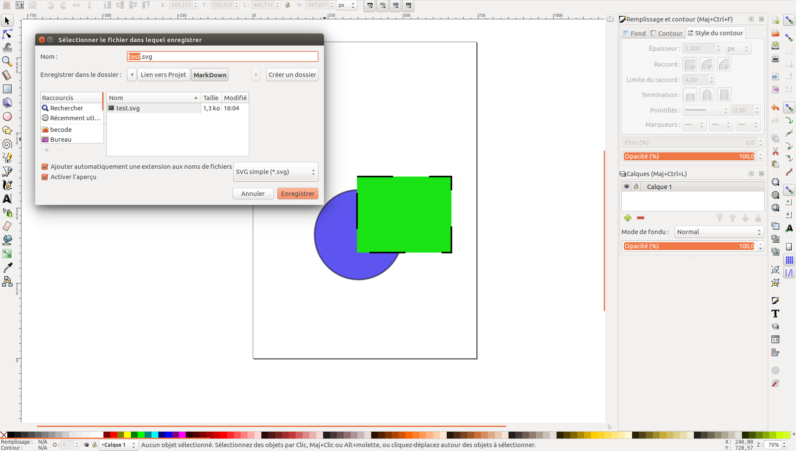
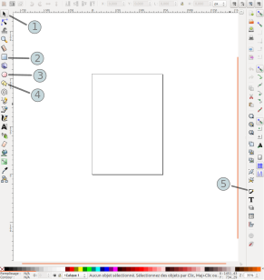
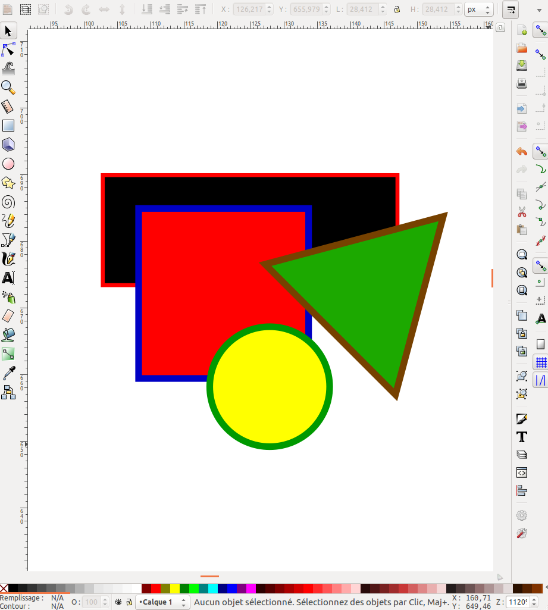
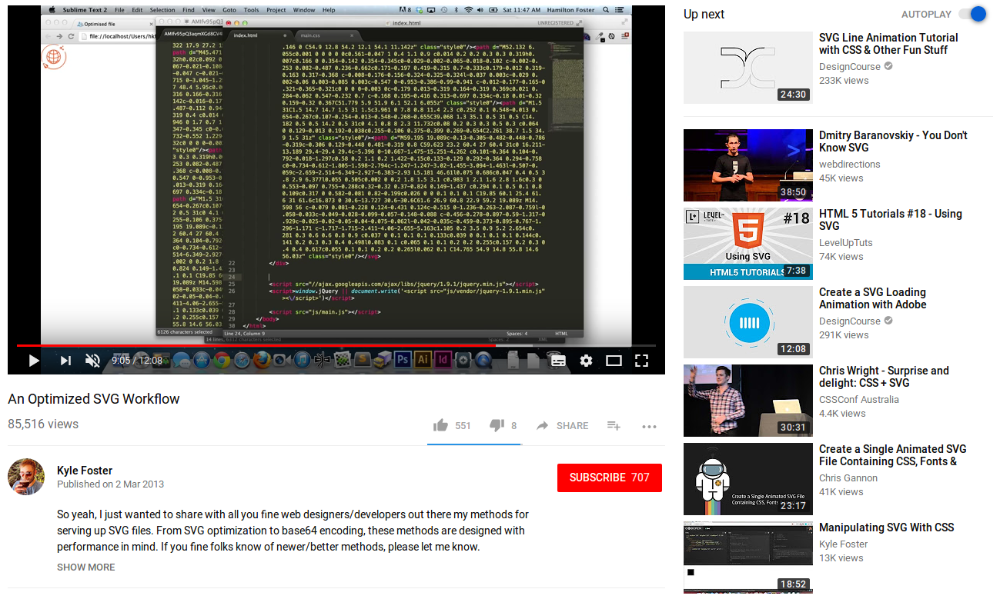
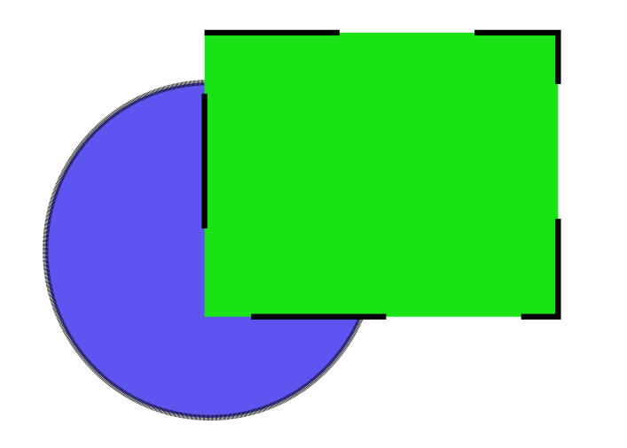
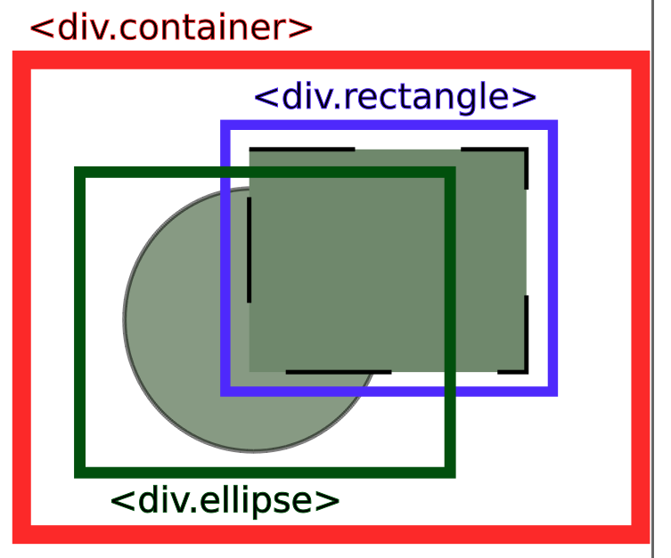
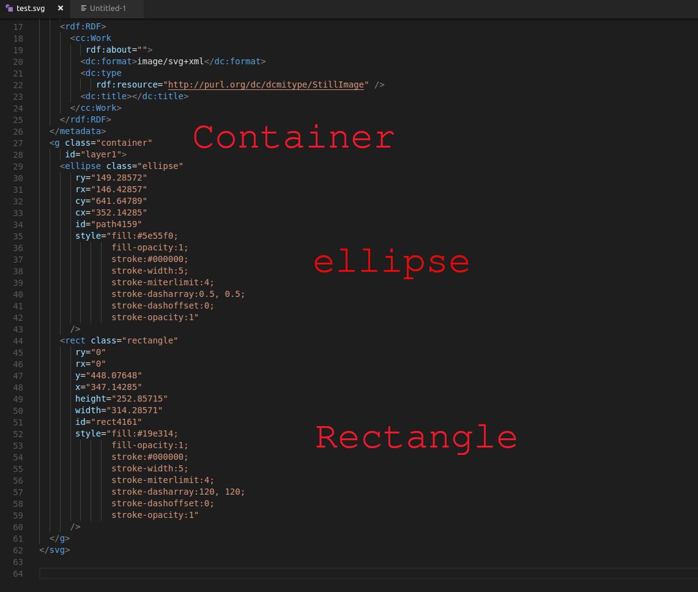

# Le format SVG

## Le format SGV c'est quoi?

Le **S**calable  **V**ector  **G**raphics « graphique vectoriel adaptable », est un format de **dessin vectoriel** capable d’etre traduit en **XML** (langage balisé). Il est approuvé par par le World Wide Web Consortium.

[]

## Pourquoi utiliser SVG? ##

* La **taille** du fichier est considérablement **réduite**. (bonne compression) (PNG = 35,5 ko (35.499 octets) -- SVG = 576 octets)
* Infiniment grand et infiniment petite. (**dessin vectoriel**)
* Le format est directement reconu en langage balisé via n'importe quel traitement de texte.
* Compatible avec tout les navigateurs. (sauf avec IE 8 et antérieurs, et Android 2.3 et antérieurs)

## Comment ca marche?

Télécharger un fichier SVG sur le net, [vive google](www.google.fr), ou encore mieux en créer une avec un logociel de dessin vectoriel comme [Illustrator](www.adobe.com) (coute une fortune) ou [Inskape](www.inskape.com) qui est plutot sympa et surtout open source.

## L'interface Inskape:

Voici les outils dont vous aurrez besoin pour éffectuer ce tuto:

1. Selectionner et transformer des objets.
2. Créer des rectangles et des carrés.
3. Créer des cercles.
4. Créer des polygones.
5. Editer les couleurs et les contours des objets.

## DEUX : Amusez-vous:

* Dessine un cercle, ajoute lui une couleur de fond et une bordure.
* Dessine un carré.
* Un rectangle.
* t un triangle.

## Optimiser le code:

Meme si le code SVG est deja tres bien optimisé à la base, il est possible de l'optimiser encore plus.
En fonction du logiciel utilisé pour generer le fichier il y a généralement un **DOCTYPE** , des **annotations** et d'autre chose qui sont inutile. Il existe des outils comme [SVGO](https://github.com/svg/svgo) de Node JS. 

#### QUATRE : Prendre le controle avec CSS:

Pour l'exemple j'ai créé un fichier SVG tres simple, deux élément: une ellipse bleu sous un rectangle vert, les deux ont un contoure de 5 pixel noir.

Si on devait refaire plus ou moins la meme chose avec du html et du css voila comment on s y prendrait:

C est maintenant qu'on va parler du code SVG et de ses balise native.
dans mon exemple on retrouve ces balise: 

* **< xml >** : parametre xml (version, UTF-8, etc..)
* **< svg >** : parametre svg ( une sorte de HTML)
* **< g >** : représente la div qui contiens tout les elements.
* **< ellipse >** : contient lles formes de type ellipse.
* **< rect >** : contient les rectangle carrés etc. *logique* :-)
* **< path >** : Pour les formes complexe la div s'appel path.

 *On reviendra sur les propriétés dans un instant.* 

Pour pouvoir modifier le css de chaque éléments il suffit de lui attribuer une class comme pour n'importe quel balise HTML traditionnel.

Comme ca il ne reste plus qu'a ajouter ces class dans le css et s'amuser à modifier le style de chque element du dessin. 

Biensur ca marche aussi avec du JS, c est ce qu'on va voir maintenant.

