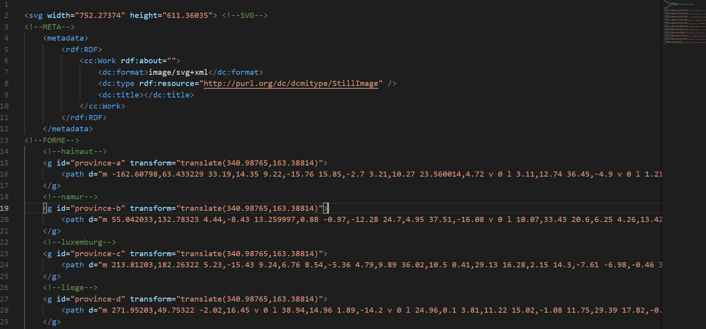
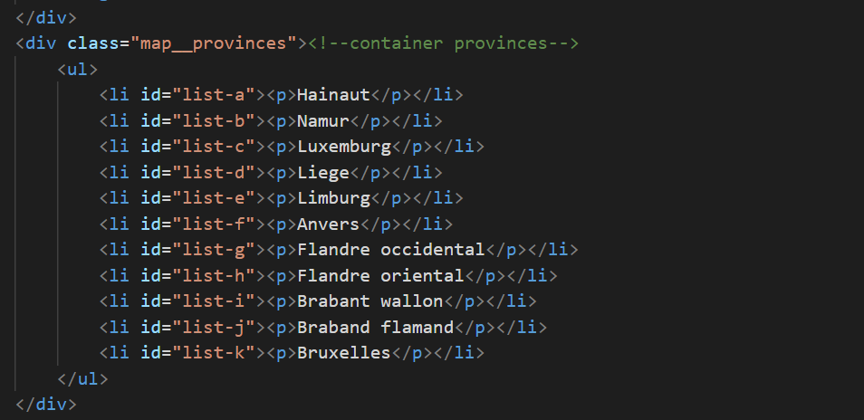

# Création d'une carte interactive.

[Voila le résultat](https://github.com/svg/svgo) et  [ici](https://github.com/svg/svgo) les fichier sources.

## Création de la carte:

* j'ai dessiné une carte de la belgique, chaque formes (provinces) est dans un calque différent ( *Travailler avec les calques et les nommer permet de créer une sorte de ```<div>``` pour chaque dessin, une chose de moins à faire lors de l'optimisation du code.* )

* Ensuite j'ai commenté et optimisé le code:

[](svg-opti.png)

## Intégration de l'image:

* Creer un document html
* Pour que ca soit plus propre y ajouter des balises ```<html>```, ```<meta>``` et ```<body>``` ;-)
* Ajouter une ```<div class="map">``` qui contiendra la carte et la liste des provinces. Dedans y ajouter deux div l'une en dessous de l'autre. ```<div class=".map__carte">``` et ```<div class="map__provinces">```. ( *[Pourquoi "__"?](https://github.com/svg/svgo)* )


* Coller le code SVG de la carte entre les balises ```<div class=".map__carte">```
* Et dans ```<div class="map__provinces">``` créer une lise avec le nom de chaque province.
* Ajouter un idantifiant à chaque province :

[](liste-code.png)


## C est la qu'on code vraiment.

### Ajout du JavaScript:

* Entre deux balise ```<script>``` :

```
let map = document.querySelector('#map');// SELECTION DE LA DIV "MAP"
let provincesImg = document.querySelectorAll('.map__carte g'); // SELECTION DE TOUT LES "G"
let provincesList = document.querySelectorAll('.map__provinces li'); // SELECTION DE TOUT LES "UL"

provincesImg.forEach(function(path){ // POUR CHAQUE "g" 
    path.addEventListener('mouseenter', function(e) { // AU MOMENT OU LE CURSEUR ENTRE DANS LA ZONE
        let id = this.id.replace('province-','')
        map.querySelectorAll('.is-active').forEach(function (item){
            item.classList.remove('is-active')
        })
        document.querySelector('#list-' + id).classList.add('is-active'); // RAJOUTE LA CLASS "is-active" 
        document.querySelector('#province-' + id).classList.add('is-active'); // RAJOUTE LA CLASS "is-active"
    })
})
```
